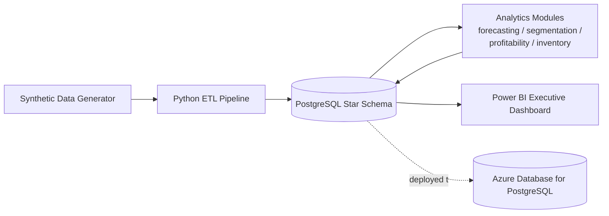

# Retail Executive Analytics Platform

An end-to-end retail analytics platform built to demonstrate data engineering and analytics
skills at production scale: a 5-10M row PostgreSQL warehouse, a Python ETL pipeline,
four analytics modules (forecasting, segmentation, profitability, inventory optimization),
a Power BI executive dashboard, and an Azure deployment.

> Status: under active development. See [docs/architecture.md](docs/architecture.md) for the
> full design and the checklist below for progress.

## Architecture



## Project checklist

- [x] Project scaffolding
- [ ] PostgreSQL star schema (5-10M row fact table)
- [ ] Python ETL pipeline
- [ ] Sales forecasting
- [ ] Customer segmentation
- [ ] Profitability analysis
- [ ] Inventory optimization
- [ ] Power BI executive dashboard
- [ ] Azure deployment
- [ ] Full documentation

## Repository layout

| Path | Purpose |
|---|---|
| `data_generation/` | Synthetic retail data generator (stores, products, customers, transactions) |
| `database/schema/` | PostgreSQL DDL — star schema, partitioning, indexes |
| `etl/` | Extract / transform / load pipeline |
| `analytics/` | Forecasting, segmentation, profitability, and inventory modules |
| `powerbi/` | Data model, DAX measures, and build guide for the executive dashboard |
| `infra/azure/` | Azure deployment scripts (PostgreSQL Flexible Server) |
| `docs/` | Architecture, data dictionary, ETL runbook, deployment guide |

## Quickstart

```bash
python -m venv .venv
.venv\Scripts\activate      # Windows
pip install -r requirements.txt
cp .env.example .env         # then edit with your local Postgres credentials
```

Setup, ETL run, and analytics instructions are documented in
[docs/etl_runbook.md](docs/etl_runbook.md) as each phase lands.

## Tech stack

Python (pandas, NumPy, SQLAlchemy, scikit-learn, statsmodels) · PostgreSQL 18 ·
Power BI · Azure Database for PostgreSQL

## License

[MIT](LICENSE)
