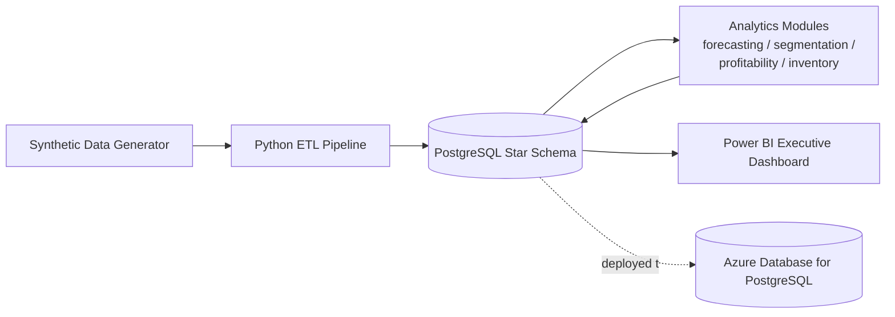

# Retail Executive Analytics Platform

An end-to-end retail analytics platform built to demonstrate data engineering and analytics
skills at production scale: a PostgreSQL warehouse, a Python ETL pipeline,
four analytics modules (forecasting, segmentation, profitability, inventory optimization),
a Power BI executive dashboard, and an Azure deployment.

See [docs/architecture.md](docs/architecture.md) for the full design rationale.

## By the numbers

- **8,997,774** rows in `fact_sales`, **4,223,479** rows in `fact_inventory` (~13.2M total)
- **300,000** synthetic customers · **3,000** products across 8 categories · **75** stores across 4 US regions
- **5 years** of daily transaction history (2021-2025) with realistic seasonality (holiday spikes, weekend lift, ~4%/year growth) driving a **$3.44B** simulated net revenue / **$1.64B** gross margin
- **6-month rolling sales forecasts** per category via Holt-Winters exponential smoothing with simulation-based prediction intervals
- **270,720** customers segmented via RFM scoring + KMeans clustering
- **204,493** store/product inventory recommendations (reorder point, safety stock, EOQ) computed from actual demand statistics and compared against current policy

## Architecture



## Project checklist

- [x] Project scaffolding
- [x] PostgreSQL star schema (~13M rows across partitioned fact tables)
- [x] Python ETL pipeline
- [x] Sales forecasting
- [x] Customer segmentation
- [x] Profitability analysis
- [x] Inventory optimization
- [ ] Power BI executive dashboard -- data model & DAX ready, report built live (GUI tool, not scriptable)
- [ ] Azure deployment -- scripts ready, run against your own Azure subscription
- [x] Full documentation

## Repository layout

| Path | Purpose |
|---|---|
| `data_generation/` | Synthetic retail data generator (stores, products, customers, transactions) |
| `database/schema/` | PostgreSQL DDL — star schema, partitioning, indexes |
| `etl/` | Extract / transform / load pipeline |
| `analytics/` | Forecasting, segmentation, profitability, and inventory modules |
| `powerbi/` | Data model, DAX measures, and build guide for the executive dashboard |
| `infra/azure/` | Azure deployment scripts (PostgreSQL Flexible Server) |
| `docs/` | Architecture, data dictionary, ETL runbook, deployment guide |

## Quickstart

```bash
python -m venv .venv
.venv\Scripts\activate      # Windows
pip install -r requirements.txt
cp .env.example .env         # then edit with your local Postgres credentials
```

Then, against an empty `retail_analytics` database, apply the schema and run
the pipeline -- full details in [docs/etl_runbook.md](docs/etl_runbook.md):

```bash
psql -U postgres -h localhost -d retail_analytics -v ON_ERROR_STOP=1 -f database/schema/01_dimensions.sql
psql -U postgres -h localhost -d retail_analytics -v ON_ERROR_STOP=1 -f database/schema/02_facts.sql
psql -U postgres -h localhost -d retail_analytics -v ON_ERROR_STOP=1 -f database/schema/03_indexes_partitions.sql
psql -U postgres -h localhost -d retail_analytics -v ON_ERROR_STOP=1 -f database/schema/04_analytics_schema.sql

python -m etl.run_pipeline --sample   # quick smoke test
python -m etl.run_pipeline            # full ~9M-row load (~20-25 min)

python -m analytics.forecasting.sales_forecast
python -m analytics.segmentation.customer_segmentation
python -m analytics.profitability.profitability_analysis
python -m analytics.inventory.inventory_optimization
```

For the dashboard and cloud deployment, see
[powerbi/build_guide.md](powerbi/build_guide.md) and
[docs/deployment_guide.md](docs/deployment_guide.md).

## Tech stack

Python (pandas, NumPy, SQLAlchemy, scikit-learn, statsmodels) · PostgreSQL 18 ·
Power BI · Azure Database for PostgreSQL

## License

[MIT](LICENSE)
