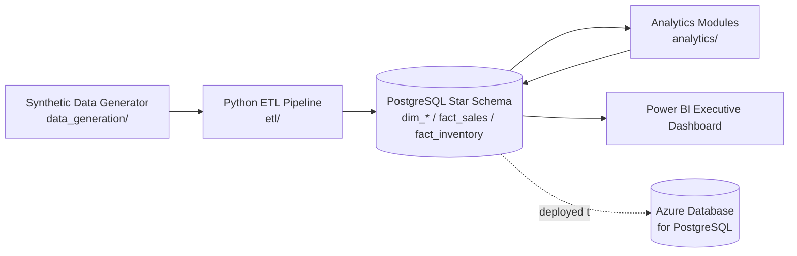

# Architecture

## Overview

## Why this shape

**Synthetic data, generated not downloaded.** There's no real retail dataset at
5-10M rows with clean licensing for a public repo, so `data_generation/` builds
one: a demand simulation with real seasonality (holiday spikes, weekday/weekend
lift, year-over-year growth) rather than uniform random noise, so the analytics
built on top of it (forecasting, segmentation) have real signal to find.

**Star schema over a normalized OLTP design.** Four dimensions
(`dim_date`, `dim_store`, `dim_product`, `dim_customer`) and two facts
(`fact_sales`, `fact_inventory`) -- optimized for the kind of slice-and-dice
aggregation a BI tool and analytics queries actually do, not for transactional
writes. `fact_sales` is range-partitioned by year, which keeps each partition's
indexes small and would let old years be archived or dropped independently in a
real deployment.

**ETL as extract / transform / load, not a single script.** `etl/extract.py`
pulls the reference calendar from Postgres and generates raw source rows;
`etl/transform.py` applies the business rules (return sign convention, derived
revenue/margin columns, null-key validation); `etl/load.py` bulk-loads via
Postgres `COPY` rather than row-by-row `INSERT`, which is the difference between
minutes and hours at this row count. `etl/run_pipeline.py` orchestrates all of
it and runs a data-quality check pass at the end.

**Analytics modules write back to Postgres, not to files.** Each of the four
modules under `analytics/` reads from the star schema and writes its output
into an `analytics` schema in the same database. That makes Postgres the single
source of truth for Power BI -- one connection, no juggling CSVs or duplicating
transformation logic inside DAX.

**Power BI built live, not generated.** Power BI Desktop is a GUI application;
there's no reasonable way to script report authoring. `powerbi/build_guide.md`
and `powerbi/dax_measures.md` document the data model and every measure needed
so the actual report-building session is fast and reproducible, but the `.pbix`
itself is hand-built.

**Azure deployment scripts, run by a human.** `infra/azure/deploy.sh` provisions
an Azure Database for PostgreSQL Flexible Server via the Azure CLI. It's a script
you run yourself against your own subscription (it creates billable resources),
not something executed automatically.

## Data flow detail

1. `database/schema/*.sql` creates the schema and populates `dim_date` (a full
   calendar with holiday flags, 2021-2026) directly via SQL -- calendars are
   deterministic, no need to generate them in Python.
2. `etl/run_pipeline.py` generates and loads `dim_store`, `dim_product`,
   `dim_customer`, then `fact_sales` year-by-year (bounding peak memory), then
   aggregates the sales just loaded to derive a monthly demand signal that
   `fact_inventory` is generated from -- inventory levels are data-driven from
   actual sales, not simulated independently.
3. The four `analytics/` modules run afterward, each reading the star schema
   and writing one or two tables into the `analytics` Postgres schema.
4. Power BI imports both the star schema and the `analytics.*` tables directly.

## Scale

At the default generation settings: **75 stores, 3,000 products, 300,000
customers, ~9M `fact_sales` rows, ~4.2M `fact_inventory` rows** (~13.2M rows
total), spanning 2021-2025 with a forecast horizon into 2026.
